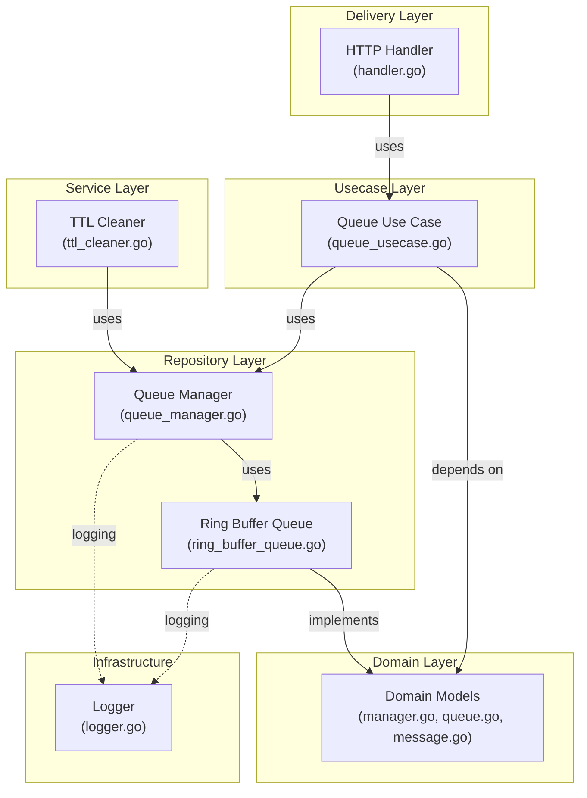

# 🐰 Baby-Rabbit

A high-performance, thread-safe queue service with TTL (Time-To-Live) support built in Go.

---

## ✨ Features

- **Ring Buffer Queue**: Circular queues for optimal performance
- **TTL Support**: Each message can have an expiration time
- **Thread-Safe**: Using Mutex and Condition Variables for thread safety
- **Automatic Cleanup**: Automatic service to remove expired messages
- **Human-Readable Logs**: Clear and understandable logging
- **RESTful API**: HTTP interface for easy interaction
- **Clean Architecture**: Clean and maintainable architecture

---

## 🏗️ Architecture & Design

### Clean Architecture

This project is designed based on **Clean Architecture** principles:



### Layer Descriptions:

#### 1. **Delivery Layer**
   - Responsible for receiving HTTP requests
   - Converts client requests into system commands
   - Returns responses

#### 2. **Use Case Layer**
   - Contains the main business logic
   - Independent of implementation details
   - Acts as a bridge between Delivery and Domain/Repository

#### 3. **Domain Layer**
   - Defines core interfaces (`Queue`, `QueueManager`)
   - Defines data models (`Message`)
   - No dependencies on frameworks

#### 4. **Repository Layer**
   - Concrete implementation of Queue
   - Uses Ring Buffer for memory efficiency
   - Manages data access

#### 5. **Service Layer**
   - Background services (TTL Cleaner)
   - Recurring tasks

#### 6. **Infrastructure**
   - Logger and utility tools

---

## 📁 Project Structure

```
Baby-Rabbit/
│
├── cmd/
│   └── server/
│       └── main.go              # Application entry point
│
├── internal/                    # Private code
│   ├── delivery/
│   │   └── http/
│   │       └── handler.go       # HTTP Handlers
│   │
│   ├── domain/                  # Domain Models
│   │   ├── manager.go          # QueueManager interface
│   │   ├── queue.go            # Queue interface
│   │   └── message.go          # Message model
│   │
│   ├── repository/             # Data Access Layer
│   │   ├── queue_manager.go    # QueueManager implementation
│   │   └── ring_buffer_queue.go # Queue implementation with Ring Buffer
│   │
│   ├── service/                # Business Services
│   │   └── ttl_cleaner.go      # TTL cleanup service
│   │
│   ├── usecase/                # Use Cases
│   │   └── queue_usecase.go    # Queue business logic
│   │
│   └── pkg/
│       └── logger/
│           └── logger.go       # Logging system
│
├── go.mod                       # Module specifications
├── go.sum                       # Lock File
└── README.md                    # This file
```

---

## 🚀 Installation & Setup

### Prerequisites

- **Go** version 1.20 or later
- **git** for cloning

### Installation Steps

1. **Clone the project:**
```bash
git clone https://github.com/yourusername/Baby-Rabbit.git
cd Baby-Rabbit
```

2. **Download Dependencies:**
```bash
go mod download
```

3. **Build the application (optional):**
```bash
go build -o baby-rabbit ./cmd/server
```

4. **Run the application:**
```bash
go run ./cmd/server/main.go
```

The server will run at `http://localhost:8080`.

---

## 📡 API Endpoints

### 1. Create a New Queue

**Endpoint:**
```
POST /queues
```

**Request:**
```json
{
  "name": "my-queue",
  "capacity": 100
}
```

**Success Response:**
```json
{
  "id": "550e8400-e29b-41d4-a716-446655440000",
  "name": "my-queue"
}
```

**Response Fields:**
- `id` (string): Unique identifier (UUID) for the queue
- `name` (string): Queue name

**Example with cURL:**
```bash
curl -X POST http://localhost:8080/queues \
  -H "Content-Type: application/json" \
  -d '{"name":"my-queue","capacity":100}'
```

---

### 2. Push Message to Queue

**Endpoint:**
```
POST /queues/:queue/push
```

**Parameters:**
- `queue`: Queue ID (UUID)

**Request:**
```json
{
  "value": "Hello, World!",
  "ttl": 3600
}
```

**Request Fields:**
- `value` (string): Message content
- `ttl` (integer): Expiration time in seconds

**Success Response:**
```json
{
  "status": "ok"
}
```

**Example with cURL:**
```bash
curl -X POST http://localhost:8080/queues/550e8400-e29b-41d4-a716-446655440000/push \
  -H "Content-Type: application/json" \
  -d '{"value":"Hello, World!","ttl":3600}'
```

---

### 3. Pop Message from Queue

**Endpoint:**
```
POST /queues/:queue/pop
```

**Parameters:**
- `queue`: Queue ID (UUID)

**Success Response:**
```json
{
  "value": "Hello, World!"
}
```

**Example with cURL:**
```bash
curl -X POST http://localhost:8080/queues/550e8400-e29b-41d4-a716-446655440000/pop \
  -H "Content-Type: application/json"
```

---

## 💡 Usage Examples

### Example 1: Basic Usage

```bash
# 1. Create a queue
curl -X POST http://localhost:8080/queues \
  -H "Content-Type: application/json" \
  -d '{"name":"messages","capacity":50}'

# 2. Push a message
curl -X POST http://localhost:8080/queues/messages/push \
  -H "Content-Type: application/json" \
  -d '{"value":"Message 1","ttl":300}'

# 3. Pop a message
curl -X POST http://localhost:8080/queues/messages/pop \
  -H "Content-Type: application/json"
```

### Example 2: Long-lived TTL

```bash
# Queue for long-running tasks
curl -X POST http://localhost:8080/queues \
  -H "Content-Type: application/json" \
  -d '{"name":"long-tasks","capacity":100}'

# Message with 24-hour TTL
curl -X POST http://localhost:8080/queues/long-tasks/push \
  -H "Content-Type: application/json" \
  -d '{"value":"Process overnight","ttl":86400}'
```

### Example 3: High-Traffic Queue

```bash
# Queue with large capacity
curl -X POST http://localhost:8080/queues \
  -H "Content-Type: application/json" \
  -d '{"name":"high-traffic","capacity":10000}'

# Add multiple messages
for i in {1..100}; do
  curl -X POST http://localhost:8080/queues/high-traffic/push \
    -H "Content-Type: application/json" \
    -d "{\"value\":\"Message $i\",\"ttl\":600}"
done
```

---

## 🔧 Clean Architecture Implementation

### How Clean Architecture Principles Are Applied:

#### 1. **Separation of Concerns**
   - Each layer has a specific responsibility
   - Changes in one layer have minimal impact on other layers

#### 2. **Dependency Inversion**
   - Upper layers depend on interfaces, not concrete implementations
   - Example: `UseCase` depends on `QueueManager` interface, not the struct

#### 3. **Testability**
   - Interfaces allow creating Mock Objects
   - Each layer can be tested independently

#### 4. **Framework Independence**
   - Domain Layer is completely independent
   - HTTP framework can be replaced without affecting business logic

---

## 📊 Architecture Analysis

### Design Patterns Used:

1. **Domain-Driven Design (DDD)**
   - Focus on Domain Models
   - Models represent business reality

2. **Repository Pattern**
   - Separation of data access from business logic
   - Ability to change data sources

3. **Dependency Injection**
   - Dependencies passed from outside
   - Increased flexibility

4. **Producer-Consumer Pattern**
   - Queues for communication between Producer and Consumer
   - Synchronization with Condition Variables

5. **Adapter Pattern**
   - HTTP Handler to convert HTTP requests

---

## 🔐 Thread Safety

- Uses `sync.Mutex` to protect shared data
- `sync.Cond` for synchronization between goroutines
- Ring Buffer implementation for optimal memory usage

---

## 📝 Logging

The logging system uses **Zap Logger** in Development Mode:

```
2026-03-06T10:30:04+01:00	INFO	Starting Baby-Rabbit server...
2026-03-06T10:30:05+01:00	INFO	Created queue: my-queue, capacity: 100
```

